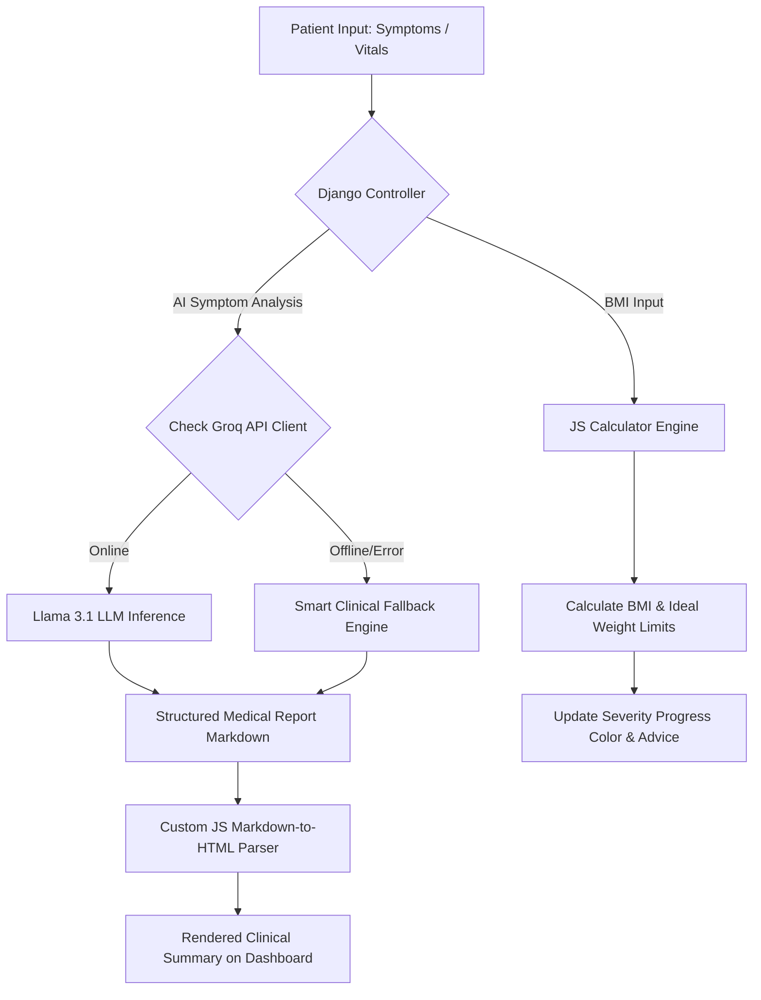

# 🏥 DocX-AI: Smart Healthcare Assistant & Diagnostic Portal

[](https://www.djangoproject.com/)
[](https://www.python.org/)
[](https://opensource.org/licenses/MIT)

**DocX-AI** is a premium, state-of-the-art clinical intelligence dashboard and medical assistant application built with Django. It bridges the gap between natural language symptom reporting and actionable medical insights by utilizing high-performance Large Language Models (LLMs) and advanced mathematical health calculators. 

Designed with a sleek, modern glassmorphism aesthetic, DocX-AI provides a responsive interface supporting real-time theme synchronization, health vitals logging, and deep diagnostic analysis.

---

## 🌟 Key Features

### 🧠 1. Clinical AI Diagnostic Portal
* **Natural Language Processing:** Allows users to describe symptoms in plain text (e.g., *"I have had a high fever and body ache since last night"*).
* **High-Fidelity AI Diagnostics:** Integrates with the **Groq Cloud API (Llama-3.1-8b-instant)** to analyze symptom severity and present professional diagnostic assessments.
* **Smart Offline Fallback Engine:** Features a rules-based Clinical Intelligence system that identifies symptom groups (fever, respiratory, gastrointestinal, head pain) and generates structured diagnostic impressions and fast-recovery protocols even if offline.
* **Custom Markdown-to-HTML Parser:** Formats raw clinical reports into beautifully indented lists, highlighted bold headers, and warning red flags dynamically on the dashboard.
* **Printable Archival Reports:** Export and print the generated medical report summaries instantly.

### 📊 2. Clinical Vitals Tracking & History
* **Vitals Vault:** Log critical daily clinical metrics such as Heart Rate (BPM), Blood Oxygen saturation (SpO2), Daily Steps, and Body Weight.
* **Archive Log:** View a searchable history of past diagnostic assessments and clinical evaluations.

### ⚖️ 3. Clinical BMI Assessment Center
* **Body Mass Index Math:** Instant calculation of body mass indicators using the clinical standard metric formula.
* **Ideal Weight Range Indicators:** Computes the patient's exact healthy weight threshold (BMI 18.5 - 24.9) for their height.
* **Dynamic Severity Progress Indicators:** Automatically shifts progress bar indicators through blue (Underweight), green (Healthy), orange (Overweight), and red (Obese) spectrums based on severity.

### 🎨 4. Premium Interface & Dark Mode
* **Glassmorphism UI:** Built with custom vanilla CSS cards, gradients, and micro-interactions.
* **Real-time Theme Sync:** Responsive light/dark mode toggling that adapts both text colors, tables, and form inputs.

---

## ⚙️ System Flow Architecture



---

## 🚀 Setup & Installation Guide

### 1. Clone & Set Up Directory
```bash
git clone https://github.com/TechAnuruddh/DocX-AI-Smart-Healthcare-Assistant.git
cd DocX-AI-Smart-Healthcare-Assistant
```

### 2. Configure Virtual Environment
```bash
python -m venv .venv
# On Windows PowerShell
.venv\Scripts\Activate.ps1
# On Linux/macOS
source .venv/bin/activate
```

### 3. Install Requirements
```bash
pip install -r requirements.txt
```

### 4. Set Environment variables
Create a `.env` file in the root directory (or update settings directly) to include your API keys:
```env
GROQ_API_KEY=your-groq-api-key-here
```

### 5. Apply Migrations & Initialize Database
```bash
python manage.py makemigrations
python manage.py migrate
```

### 6. Create Superuser (Admin Portal Access)
```bash
python manage.py createsuperuser
```

### 7. Run Server
```bash
python manage.py runserver
```
Visit the application in your browser at `http://127.0.0.1:8000/`.

---

## 📁 Project Directory Map

```
DocX-AI-Smart-Healthcare-Assistant/
│
├── core/                       # App views, models, forms, and routes
│   ├── models.py               # Database schemas (SymptomEntry, VitalsRecord)
│   ├── views.py                # AI prompt logic & fallback engines
│   ├── forms.py                # User Registration & Vitals Input Forms
│   └── urls.py                 # Core path routing
│
├── templates/core/             # UI Templates
│   ├── base.html               # Main layouts, styling, & theme control
│   ├── dashboard.html          # Vitals tracking & primary index views
│   ├── add_symptom.html        # Diagnostic symptom submit form
│   ├── symptom_history.html    # Archived reports logs
│   └── health_tips.html        # Articles grid & BMI calculator
│
├── docx_project/               # Project configuration settings
├── static/                     # Custom assets, images & CSS
├── requirements.txt            # Project dependencies
└── README.md                   # Project documentation
```

---

## 📋 Clinical Disclaimer
> [!IMPORTANT]
> **DocX-AI is an educational demonstration tool.** The assessments, recovery recommendations, and BMI indices provided are generated by artificial intelligence and automated clinical heuristics. They do not constitute official medical advice, and should never replace evaluation by an accredited healthcare provider. In case of serious physical symptoms or medical emergencies, consult professional emergency services immediately.

---

## 👨‍💻 Author Profile

<div align="center">
  <h3>Developed with ❤️ by</h3>
  <h2>Anuruddh Yadav</h2>
  <p><i>Full-Stack Developer | AI Integration Specialist</i></p>
  <p>
    <a href="https://github.com/TechAnuruddh"></a>
  </p>
</div>
